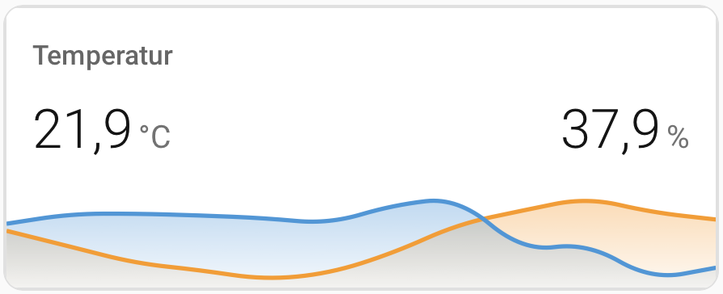
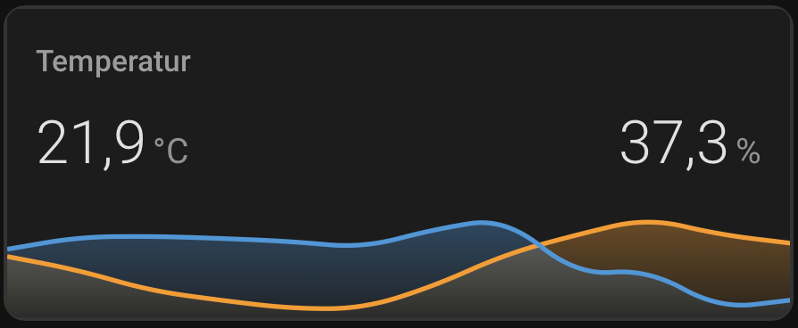

# 🌡️ Minimalist Climate Stack Card for Home Assistant

A sleek, space-saving dashboard card to display temperature and humidity in a single, seamless graph. Designed by **Landako1**.

## 📸 Preview

| Light Mode | Dark Mode |
| --- | --- |
|  |  |

---

## ✨ Features
- **Seamless Integration:** Uses `stack-in-card` to merge elements without visible borders.
- **Dual Y-Axis:** Independent scales for Temperature (left) and Humidity (right).
- **Mold Prevention:** Visual color thresholds for humidity.
- **Modern Aesthetics:** Features smooth curves and faded fills.

## 🛠️ Requirements
This card requires the following frontend plugins from **HACS**:
1. [stack-in-card](https://github.com/custom-cards/stack-in-card)
2. [mini-graph-card](https://github.com/kalkih/mini-graph-card)
3. [card-mod](https://github.com/thomasloven/lovelace-card-mod)

## 🚀 Installation & Usage

### Manual install:
1. Copy the code from `climate-card.yaml`.
2. Add a **Manual Card** to your dashboard and paste the code.
3. Replace the sensor entities with your own.

---
*Created with ❤️ by Landako1. If you like this, please ⭐ the repo!*
